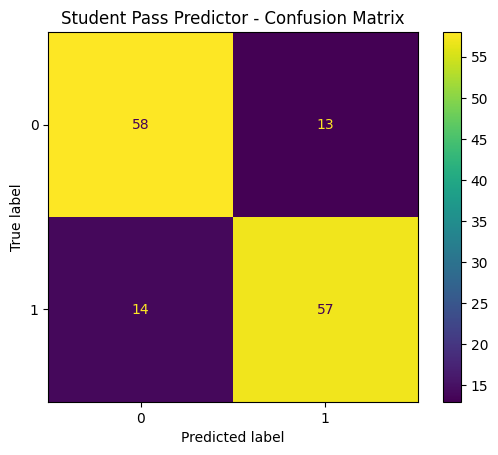

# Student Pass Predictor

## Overview

Predict whether a student will pass or fail based on:

* Study Hours per Week
* Attendance Rate
* Previous Exam Scores

## Model

* Logistic Regression
* Feature Scaling using StandardScaler
* Binary Classification

## Results

* Accuracy: 80.99%

### Confusion Matrix

[[58 13]
[14 57]]

## Deployment

* FastAPI-based prediction service
* Interactive frontend with slider inputs
* Deployed on Render

## Key Learnings

* Logistic Regression
* Sigmoid Function
* Binary Cross Entropy (Log Loss)
* Gradient Descent
* Feature Scaling
* Model Evaluation
* FastAPI Deployment
